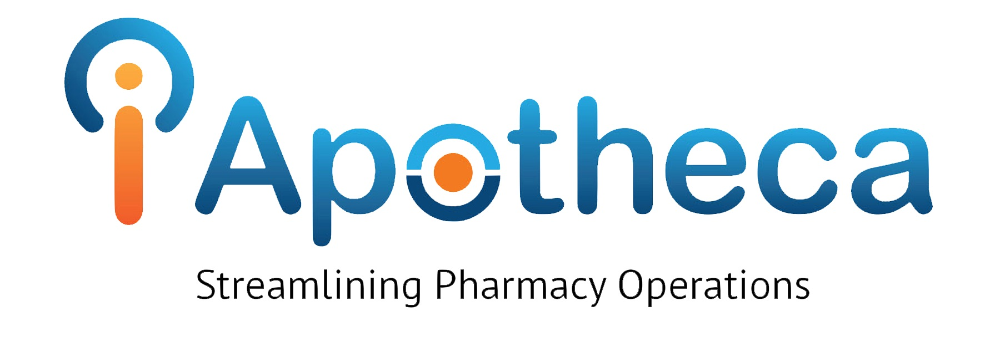
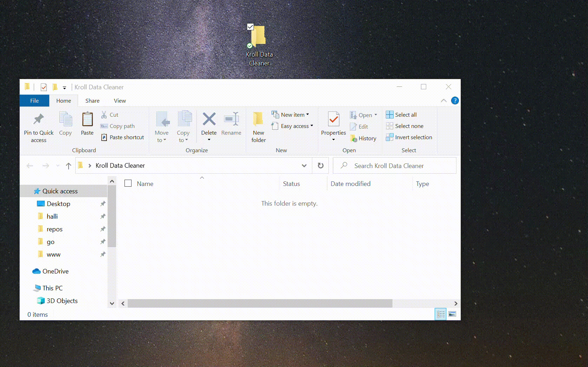
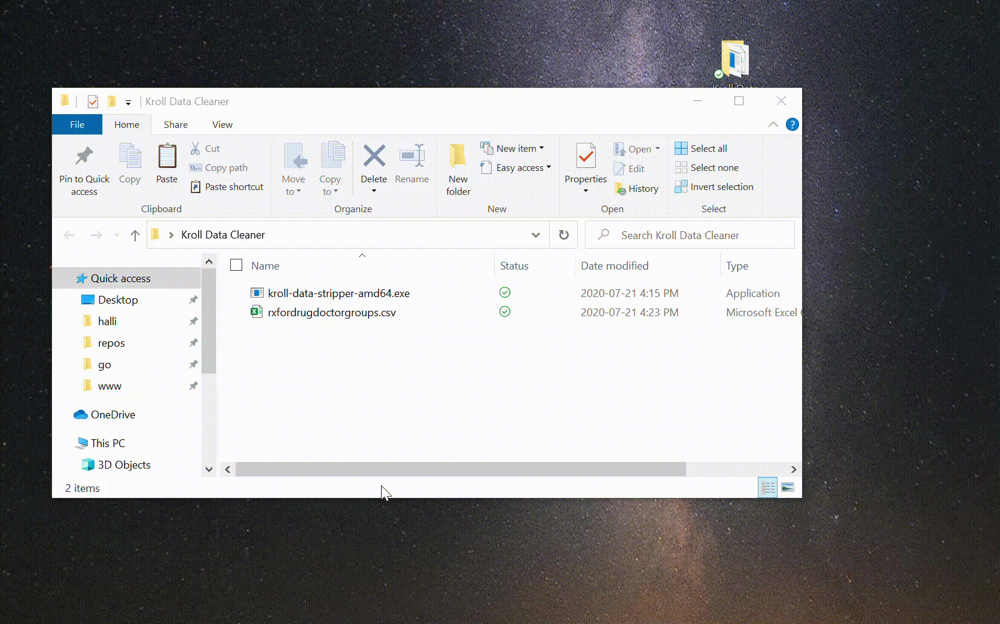
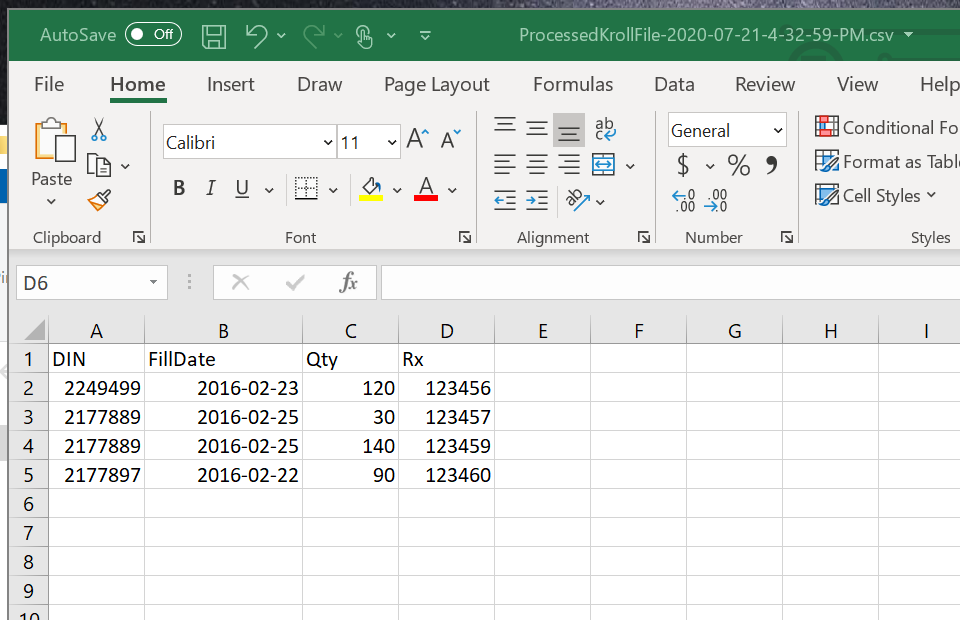

<p align="center"></p>

# kroll-data-stripper
This will take the RxForDrugDoctorGroups report and takes out all the data other than Din, Fill Date, Fill Quantity, and Rx#

## Installation
1. Create a folder - call it what ever you'd like.

<p align="center"></p>

2. Drag the binary (.exe file) from /bin into the new folder

<p align="center"></p>
Something to note in golang is that it's all self-contained binaries, which means no installing dependencies.

## Usage

1. Drag your RxForDrugDoctorGroups file into your processor folder

<p align="center"></p>

2. Run the program (double click)
<p align="center"></p>

3. See the output without any patient info
<p align="center"></p>

4. Upload the processed file to the iApotheca Platform

## How To Build The Binary
This uses standard golang build process.

Make sure you have golang installed on your system first. - https://golang.org/

```
# Build for 32bit systems
set GOOARCH=386
go build -o bin/kroll-data-stripper-x86.exe --buildmode=exe main.go

# Build for 64bit systems
set GOOARCH=amd64
go build -o bin/kroll-data-stripper-amd64.exe --buildmode=exe main.go
```

Or - if you have makefile installed on your system - https://www.gnu.org/software/make/
```
make package
```

Then the built binaries will be in the bin folder

## Packages Used
* manifoldco/promptui - github.com/manifoldco/promptui - This is used for the prompts in the console application the application.  (LICENSE: BSD-3-Clause - see LICENSE.md or browse to github.com/manifoldco/promptui/blob/master/LICENSE.md)
* araddon/dateparse - github.com/araddon/dateparse - This is used to make dates extremely readable - it parses many different date formats properly (LICENSE: MIT - see LICENSE.md or browse to github.com/araddon/dateparse/blob/master/LICENSE)
* tushar2708/altcsv - github.com/tushar2708/altcsv - This is used to safetly write the CentralSales.csv file at the end (LICENSE: BSD-3-Clause - see LICENSE.md or browse to https://github.com/tushar2708/altcsv/blob/master/LICENSE)

